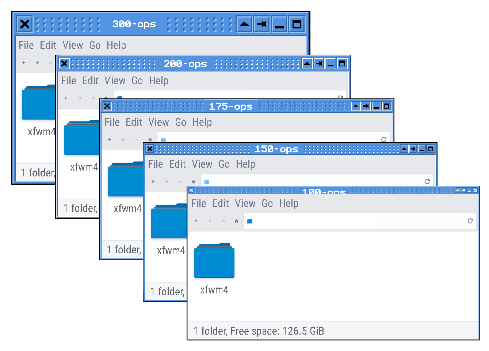
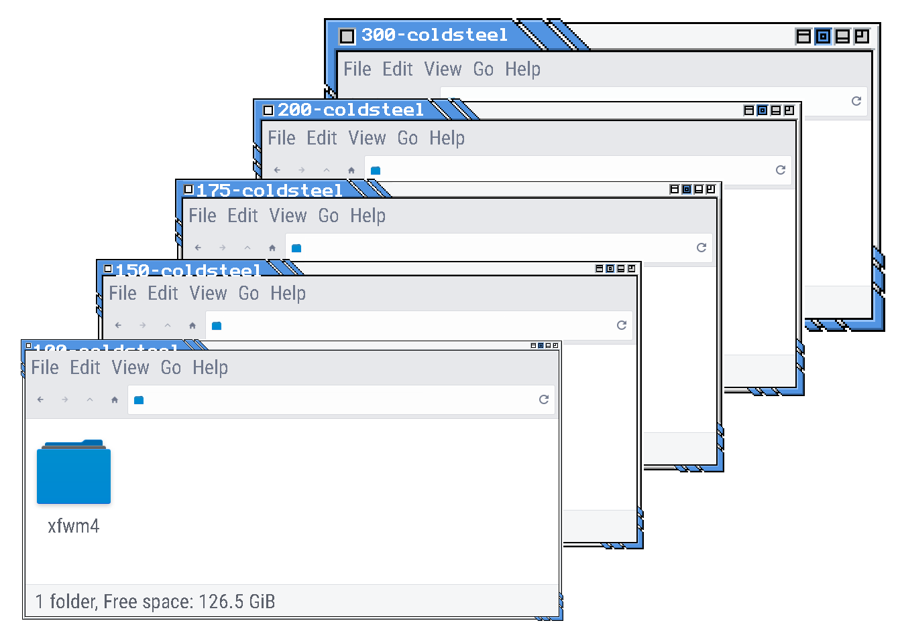
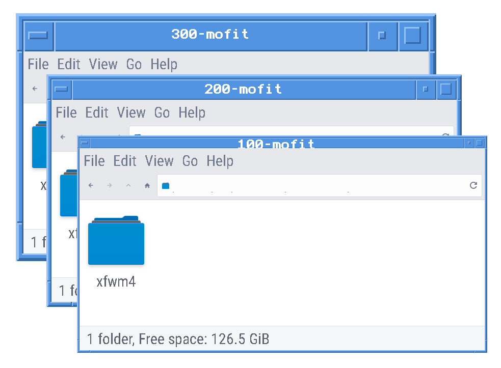
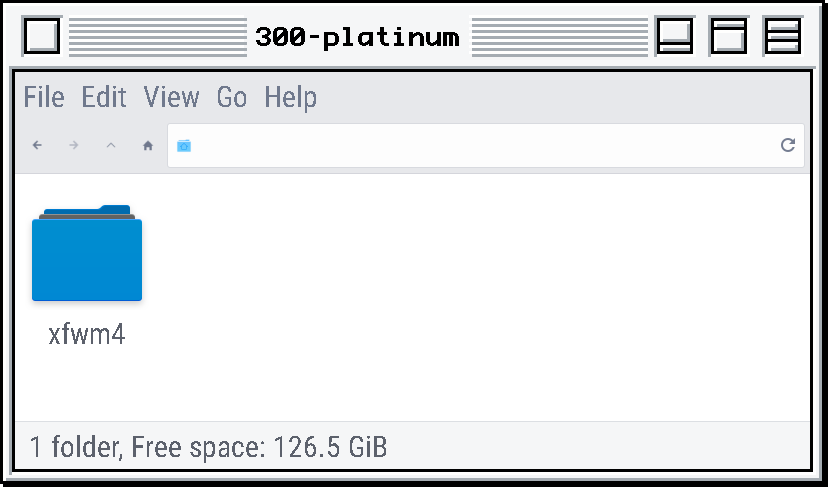
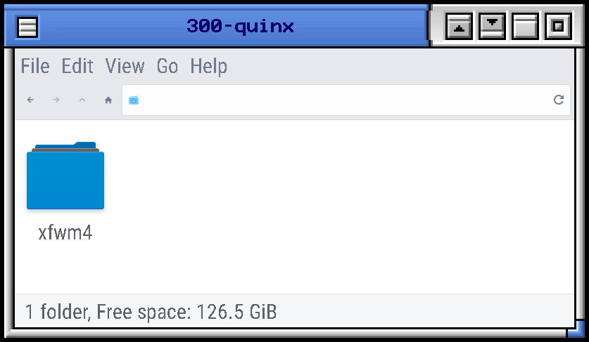

# xfwm4 themes in HiDPI

I made this because when I enabled [HiDPI in xfce4](https://wiki.archlinux.org/title/HiDPI#Xfce), almost all of the `xfwm` themes available were unusably small.

## Known issues

Themes which include `.svg` files are not properly adjusted by the below. Affected is `default-4.4`, `default-4.6` and `default-4.8`.

## Install

Clone the repo or download the `.zip`  from github. To get the `zip` file, scroll to the top of the [repo main page](https://github.com/CouldBeThis/xfwm4-themes-HiDPI/) and click the green "Code" button which should open a pop-up. Select "download ZIP". Once you extract the `zip` file you will have the entire repo. 

Find the themes you want and install them into either your user or system theme folder. More info on that: [howto:xfwm4_theme [Xfce Wiki] Themes locations](https://wiki.xfce.org/howto/xfwm4_theme#themes_locations).

You must put the theme folder itself into the appropriate directory. For example, if you move the directory  [`themes-175`](themes-175) into `~/.themes`, it will *not* work. Rather, you must move/copy, for examples the folder `iceg`  itself into `~/.themes`. 

Of course  this makes a conflict if you want to have more than one size installed of a given themes. Which is why I use symlinks instead. 

### Symlink all themes into user theme folder

This will allow easy `pull` from git in case there is an update in 20 years. It also allows you to name themes according to your preference. 

In the terminal, `cd` into the directory containing the size you want, for example [`themes-200`](themes-200)

* the below will precede all names with `200-`; omit or change per your preference


```sh
ls -1 | xargs -I @ ln -s $PWD/@ ~/.themes/200-@
```


### Repo organization

Each directory contains a full set of themes at the magnification % indicated by the name. For example [`themes-175`](themes-175) are themes at 175% magnification.  [`themes-100`](themes-100)  are the themes at 100% magnification, which is to say unmodified, for convenience and reference. 

## Screenshots

Here are a few examples. Except as noted above (the `default` themes) all the themes are present in all the sizes; I just got lazy making screenshots. 











Using the GTK theme `Arc-solid`. 

## How it was made, and how to do the same on other themes

This is pretty crude but gets the basics done with a minimum of fooling around. Individual themes would benefit from touching up by hand, especially with regards to lines that got excessively thickened. This is a great start though. 

I used [`ImageMagick`](https://imagemagick.org/)'s [`-sample`](https://imagemagick.org/Usage/resize/#sample) to resize without any fancy interpolation.   Using another method, such as [`mogrify`](https://imagemagick.org/script/mogrify.php) will not work properly because creates a blur effect which looks crappy in general but crucially will prevent correct color pickup from `gtk` theme on those themes which have the capability. 

#### Important to note

* It will descend into subdirectories (it is recursive) so can be performed on any number of themes at once. 

* It will **overwrite** existing files. Do this on a *copy* if you wish to retain originals.

* On my low powered computer, this operation takes a few minutes to run on the entire collection. Be patient.


In the terminal, `cd` into a directory containing themes you wish to make larger, then run:

```sh
find . -name "*.xpm" -o -name "*.png" | xargs -I @ magick @ -sample 175% @
```


